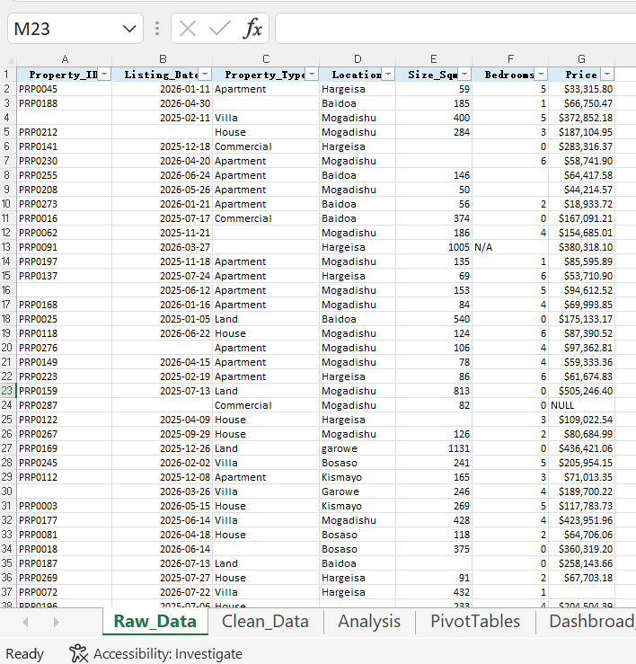
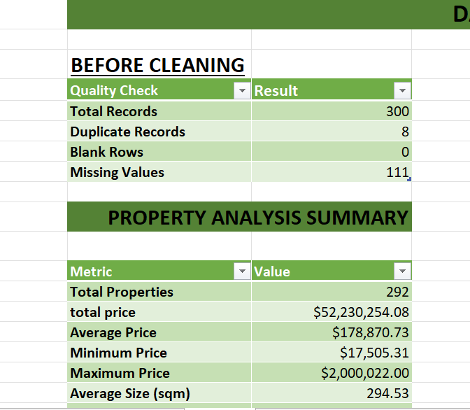
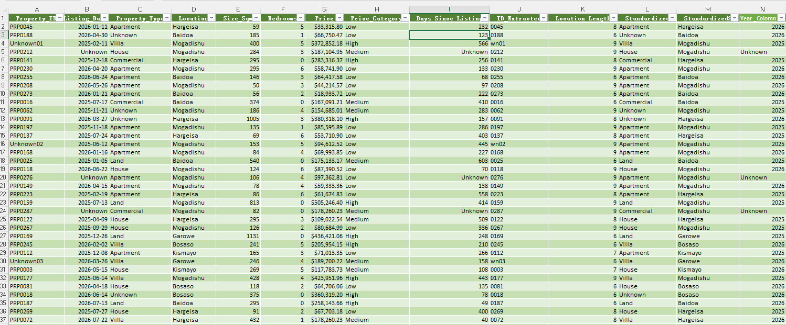
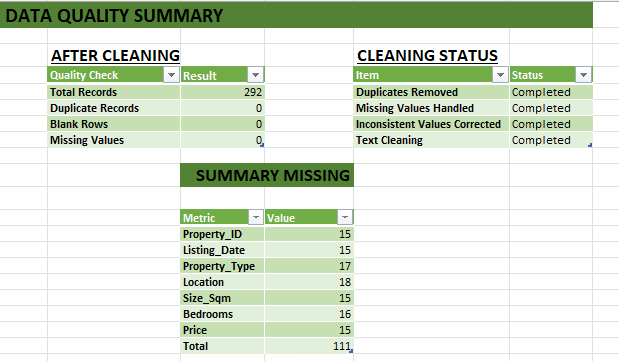
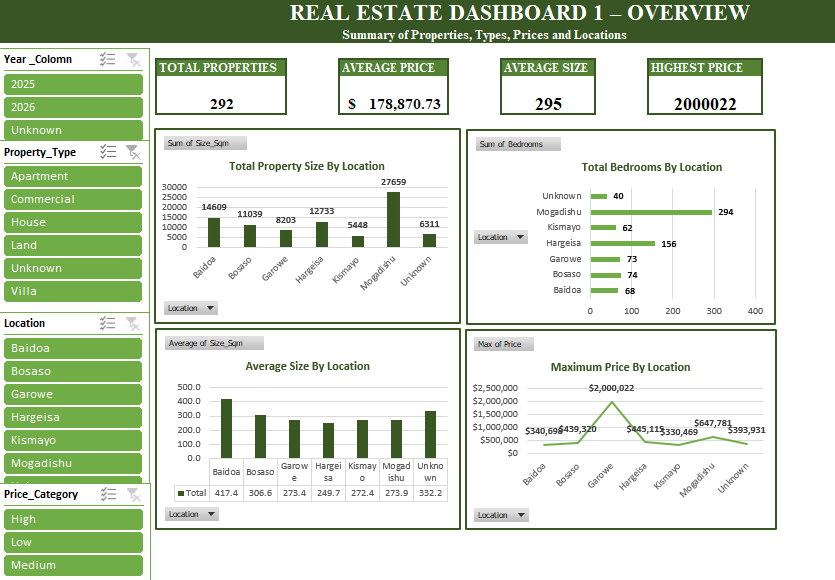
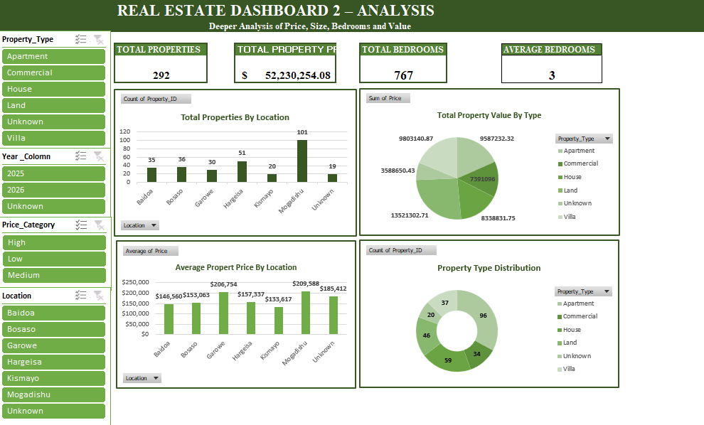
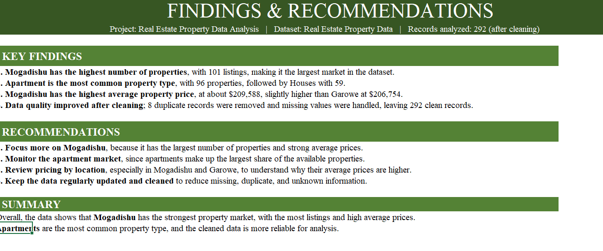

# Real Estate Property Data Analysis Using Excel

An Excel-based data analysis project focused on cleaning, analyzing, and
visualizing real estate property data.

## Project Overview

This project analyzes a real estate dataset using Microsoft Excel. The
workflow starts with raw property data, applies data-quality checks and
cleaning, performs descriptive analysis and PivotTable analysis, and
finishes with two dashboards and a findings sheet.

### Main objectives

-   Inspect the quality of the raw dataset
-   Identify and remove duplicate records
-   Handle missing values
-   Standardize inconsistent text/category values
-   Create calculated fields
-   Analyze prices, sizes, bedrooms, dates, types, and locations
-   Build PivotTables and dashboard visualizations
-   Present key findings and recommendations

## Dataset

  Item                                  Result
  -------------------------------- -----------
  Raw records                              300
  Duplicate records removed                  8
  Clean records                            292
  Missing values before cleaning           111
  2025 listings                            169
  2026 listings                            107
  Most common property type          Apartment
  Most common location               Mogadishu

## Workbook Structure

-   **Raw_Data** - original dataset
-   **Clean_Data** - cleaned dataset and calculated fields
-   **Analysis** - data-quality summary and analytical metrics
-   **PivotTables** - PivotTable analysis
-   **Dashbroad_1** - overview dashboard
-   **Dashbroad_2** - detailed analysis dashboard
-   **Findings** - findings and recommendations

## Step-by-Step Process

### 1. Inspect the Raw Data

The `Raw_Data` sheet is kept as the starting point for the project.



### 2. Check Data Quality

The raw data was checked for duplicate Property IDs, blank rows, missing
values, inconsistent categories, extra spaces, and unknown/invalid
values.

Before cleaning:

-   300 total records
-   8 duplicate records
-   111 missing values
-   0 blank rows



### 3. Clean the Data

Duplicate records were removed and missing/inconsistent values were
handled. Text fields were standardized.

Calculated fields in `Clean_Data` include:

-   `Price_Category`
-   `Days Since Listing`
-   `ID_Extracted`
-   `Location Length`
-   `Standardized`
-   `Year`



### 4. Verify the Cleaning

After cleaning, the workbook contains 292 records, with duplicates and
blank rows removed and missing values handled.



### 5. Perform Excel Analysis

Examples of formulas used:

``` excel
=COUNTA(Clean_Data!A2:A1000)
=AVERAGE(Clean_Data!G2:G293)
=MIN(Clean_Data!G2:G293)
=MAX(Clean_Data!G2:G293)
=COUNTBLANK(Raw_Data!A2:A301)
=COUNTIFS(PropertyTable[Listing_Date],">="&DATE(2025,1,1),PropertyTable[Listing_Date],"<"&DATE(2026,1,1))
=COUNTIFS(PropertyTable[Listing_Date],">="&DATE(2026,1,1),PropertyTable[Listing_Date],"<"&DATE(2027,1,1))
=INDEX(Clean_Data!C2:C293,MODE(MATCH(Clean_Data!C2:C293,Clean_Data!C2:C293,0)))
```

### 6. PivotTable Analysis

The `PivotTables` sheet summarizes properties by location, size, price,
property type, and bedrooms.

## Key Results

-   **292** properties after cleaning
-   **8** duplicate records removed
-   **111** missing values identified before cleaning
-   **169** listings in 2025
-   **107** listings in 2026
-   **Apartment** is the most common property type with **96**
    properties
-   **Mogadishu** has the most listings with **101** properties
-   Average price: **\$178,870.73**
-   Average size: **294.53 sqm**
-   Average bedrooms: **2.63**
-   Highest recorded price: **\$2,000,022**

## Dashboard 1: Overview

The first dashboard provides a high-level view of the real estate
dataset.



## Dashboard 2: Detailed Analysis

The second dashboard provides deeper analysis of price, value, property
type, size, and bedrooms.



## Key Findings

1.  Mogadishu has the highest number of properties, with 101 listings.
2.  Apartments are the most common property type, with 96 properties.
3.  Mogadishu has the highest average property price, at approximately
    \$209,588.
4.  Garowe has the second-highest average property price, at
    approximately \$206,754.
5.  Data quality improved after cleaning, with 8 duplicate records
    removed and missing values handled.



## Recommendations

-   Focus more analysis on Mogadishu because it has the largest number
    of listings and a high average price.
-   Monitor the apartment market because apartments are the largest
    property-type group.
-   Compare prices by location to understand differences in market
    value.
-   Continue regular data cleaning to reduce duplicate, missing, and
    unknown information.

## Tools Used

-   Microsoft Excel
-   Excel Tables
-   Excel formulas and functions
-   Conditional Formatting
-   Sorting and Filtering
-   Data Cleaning
-   PivotTables
-   PivotCharts
-   Slicers
-   Dashboard design

## Project Workflow

``` text
Raw Data
   ↓
Data Quality Inspection
   ↓
Duplicate & Missing Value Handling
   ↓
Text / Category Standardization
   ↓
Clean Data
   ↓
Excel Analysis
   ↓
PivotTables & Charts
   ↓
Dashboards
   ↓
Findings & Recommendations
```

## Repository Structure

``` text
Real-Estate-Property-Data-Analysis/
│
├── Real Estate Property Data Analysis Using Excel.xlsx
├── README.md
└── screenshots/
    ├── 01-raw-data.png
    ├── 02-clean-data.png
    ├── 03-data-quality-before.png
    ├── 04-data-quality-after.png
    ├── 05-dashboard-overview.png
    ├── 06-dashboard-analysis.png
    └── 07-key-findings.png
```

## How to Use

1.  Open the Excel workbook in Microsoft Excel.
2.  Start with `Raw_Data`.
3.  Review `Clean_Data` for the cleaned records.
4.  Review `Analysis` and `PivotTables`.
5.  Open `Dashbroad_1` and `Dashbroad_2`.
6.  Open `Findings` for the final conclusions.

## Author

**Real Estate Property Data Analysis Using Excel**

Cayni abukar maxamu
