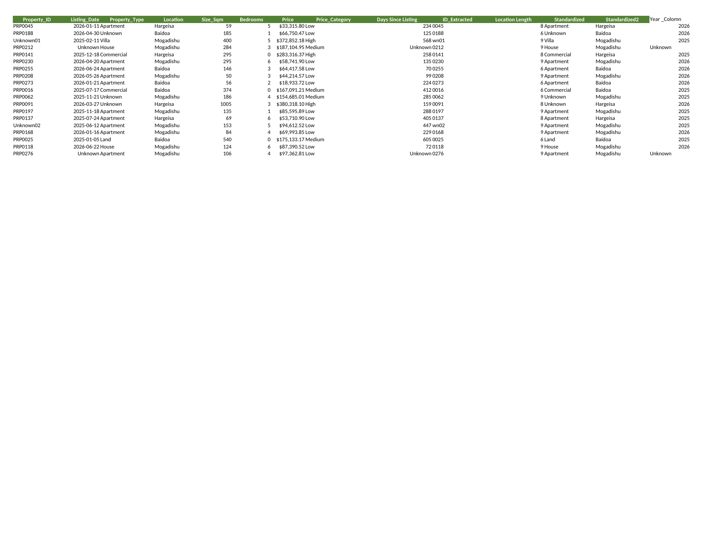
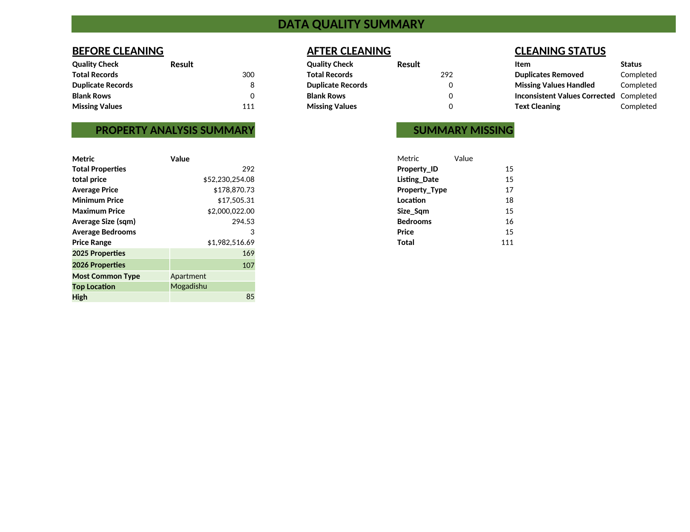
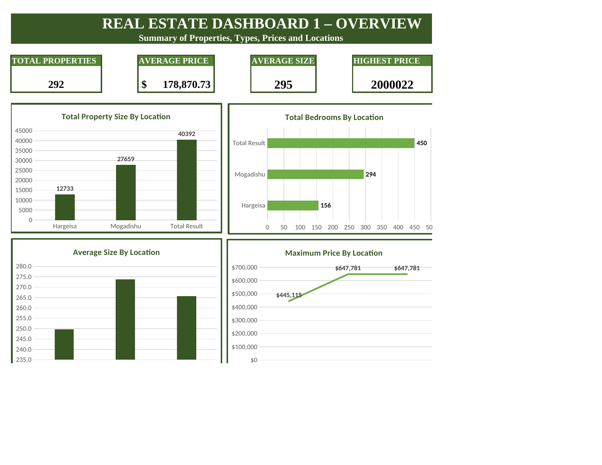
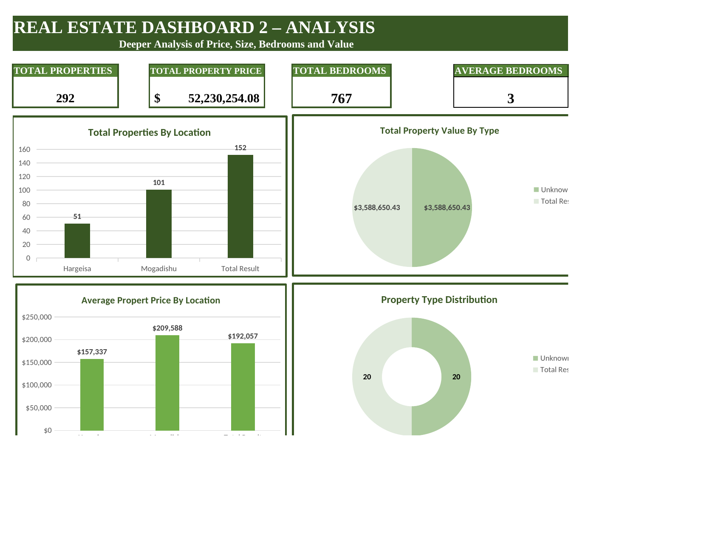
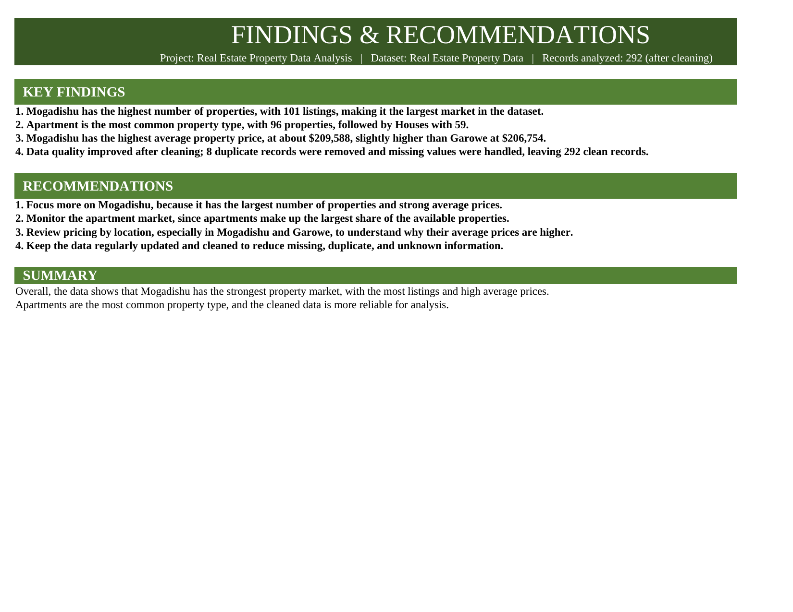

# 🏠 Real Estate Property Data Analysis Using Excel

## Project Overview

This project analyzes a real estate property dataset using **Microsoft Excel**. The main goal is to clean the raw property data, improve its quality, analyze prices, property types, locations, sizes, and bedrooms, and present the results through dashboards and key findings.

The dataset originally contained **300 records**. During the cleaning process, **8 duplicate records** were removed and missing values were handled, leaving **292 clean records** for the final analysis.

The project is organized into separate Excel sheets for raw data, cleaned data, analysis, pivot tables, dashboards, and findings. A PowerPoint presentation and project report can be added inside the `PPT_file` folder.

---

## 📁 Project Structure

```text
Real_Estate_Property_Data_Analysis/
│
├── Real_Estate_Property_Data_Analysis_Using_Excel.xlsx
├── README.md
│
├── PPT_file/
│   ├── Crime_... (add your PPT here)
│   └── ... (add your Report here)
│
└── screenshots/
    ├── clean_data_preview.png
    ├── analysis.png
    ├── dashboard1.png
    ├── dashboard2.png
    └── findings.png
```

---

## 🧹 Data Cleaning

The raw dataset was reviewed and cleaned before analysis. The main cleaning activities included:

- Removing **8 duplicate records**.
- Handling **111 missing values**.
- Standardizing inconsistent text and property information.
- Checking fields such as Property ID, Listing Date, Property Type, Location, Size, Bedrooms, and Price.
- Creating additional fields used for analysis, including price categories and date-related information.

### Before vs After

| Check | Before Cleaning | After Cleaning |
|---|---:|---:|
| Total Records | 300 | 292 |
| Duplicate Records | 8 | 0 |
| Missing Values | 111 | 0 |
| Blank Rows | 0 | 0 |

**Interpretation:** The cleaning process improved the reliability of the dataset and made it more suitable for analysis and decision-making.

---

## 📊 Excel Analysis

The Excel workbook contains the following main sheets:

- **Raw_Data** – original property data before cleaning.
- **Clean_Data** – cleaned and prepared data used for analysis.
- **Analysis** – data quality checks and summary statistics.
- **PivotTables** – summarized data used to understand locations, property types, prices, and other patterns.
- **Dashbroad_1** – overall property market dashboard.
- **Dashbroad_2** – deeper analysis of price, size, bedrooms, and value.
- **Findings** – final findings and recommendations.

---

# 📸 Screenshots & Interpretation

## 1. Clean Data Preview



### Interpretation
This screenshot shows the cleaned dataset after removing duplicates, handling missing information, and standardizing the data. The cleaned table provides a better foundation for the analysis because the information is more consistent and complete.

---

## 2. Data Quality & Analysis



### Interpretation
The analysis sheet compares the dataset before and after cleaning and summarizes the main property statistics. After cleaning, there are **292 properties**, with an average price of approximately **$178,871**, an average size of about **294.5 sqm**, and an average of about **2.6 bedrooms**.

The analysis also shows that **Apartment** is the most common property type and **Mogadishu** is the top location in the dataset.

---

## 3. Dashboard 1 – Market Overview



### Interpretation
Dashboard 1 provides a high-level view of the real estate market. It summarizes the total number of properties, average price, average property size, and highest recorded price.

The dashboard helps users quickly understand the overall market without having to inspect the raw rows individually.

**Key figures:**
- Total Properties: **292**
- Average Price: **$178,871**
- Average Size: **294.5 sqm**
- Highest Price: **$2,000,022**

---

## 4. Dashboard 2 – Detailed Analysis



### Interpretation
Dashboard 2 gives a deeper view of property value and characteristics. It looks at total property price, bedrooms, average bedrooms, and other market relationships.

This dashboard is useful for comparing property characteristics and understanding how the dataset behaves beyond simple property counts.

**Key figures:**
- Total Properties: **292**
- Total Property Price: approximately **$52.23 million**
- Total Bedrooms: **767**
- Average Bedrooms: **2.63**

---

## 5. Findings & Recommendations



### Interpretation
The findings sheet brings the analysis together into clear conclusions and practical recommendations.

### Key Findings
1. **Mogadishu has the highest number of properties**, with **101 listings**, making it the largest market in the dataset.
2. **Apartments are the most common property type**, with **96 properties**, followed by Houses with 59.
3. **Mogadishu has the highest average property price**, at approximately **$209,588**, slightly above Garowe at about **$206,754**.
4. **Data quality improved after cleaning** because duplicate and missing information was addressed, leaving 292 usable records.

### Recommendations
1. Focus more on **Mogadishu** because it has the largest number of properties and strong average prices.
2. Monitor the **apartment market** because apartments represent the largest share of the dataset.
3. Compare pricing between locations such as **Mogadishu and Garowe** to understand differences in property values.
4. Continue regular **data cleaning and updating** to reduce duplicates, missing values, and inconsistent information.

---

## 📌 Overall Project Summary

Overall, the analysis shows that **Mogadishu is the strongest property market in this dataset**, based on the number of listings and high average prices. **Apartments are the most common property type**, while the cleaning process significantly improved the quality and reliability of the data.

The Excel dashboards make the results easier to understand, while the findings and recommendations turn the analysis into useful information for real estate decision-making.

---

## 🛠️ Tools Used

- **Microsoft Excel** – data cleaning, formulas, pivot tables, analysis, and dashboards.
- **GitHub** – project storage and portfolio presentation.
- **PowerPoint** – presentation of the project results (to be added in `PPT_file`).

## 👤 Prepared By

**Real Estate Property Data Analysis Project**
